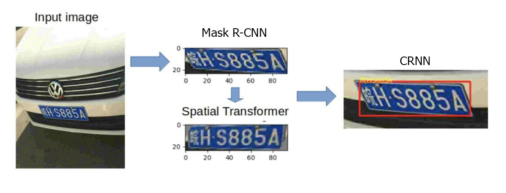
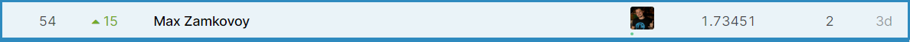

# MADE Car plates OCR

В качестве backbone'а использовалась модель maskrcnn_resnet50_fpn с двумя головами: fastrcnnpredictor для координат и maskrcnnpredictor для масок. Первая модель обучалась 2 эпохи с learning_rate 0.001 на всем датасете. Предсказания подбирались с трешхолдом 0.9. В качестве CRN модели была взята модель CRNN из семинара. Она обучалась 2 эпохи с learning_rate 0.001.

Вторая модель состоит из feature extractor'а и sequence predictor'а. Первый является моделью с resnet18 в качестве backbone с пулингом и сверткой на выходе. Второй является рннкой (GRU) и линейным слоем.

